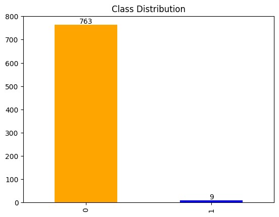
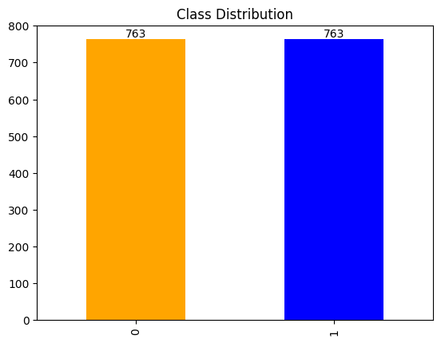

# Sampling Assignment

#### Kriti Singhal

#### 102017079

## Introduction

In this assignment, first the dataset called "Creditcard_data.csv" is read and then oversampling using SMOTE is performed in order to make the datset balanced. The distribution of the data before and after oversampling is shown below.

 

### Before Oversampling

 

### After Oversampling

 
 

After balancing the data is then sampled using the following methods:

1. Simple Random Sampling
2. Systematic Sampling
3. Stratified Sampling
4. Cluster Sampling

 

## Model Building

After performing the sampling methods, the data is then split into training(80%) and testing data(20%). The following models are then built on the training data for each sample:

1. Logistic Regression
2. Decision Tree
3. Random Forest
4. KNN
5. SVM
